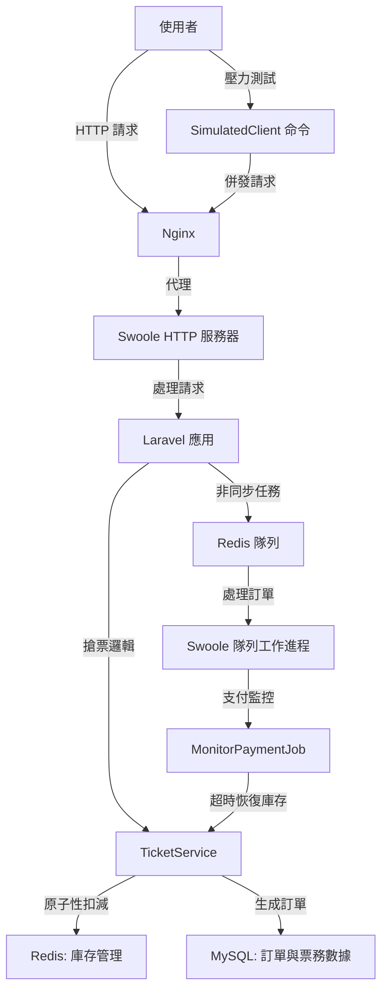

# SnapTicket - 高併發搶票系統

     

**SnapTicket** 是一個基於 **Laravel**、**Redis** 和 **Swoole** 打造的高併發搶票系統，專為大規模票務搶購場景設計。本專案僅包含應用層核心代碼（模型、控制器、服務、遷移等），不包含 Laravel 框架基礎代碼（例如 `vendor/` 目錄）。您需要通過 Composer 安裝 Laravel 及其依賴來運行專案。系統利用原子性庫存管理、非同步訂單處理和壓力測試工具，實現高效、穩定的搶票體驗。

## 專案亮點
- **高併發搶票**：採用 Redis Lua 腳本實現庫存扣減的原子性，防止超賣。
- **非同步訂單處理**：支援支付超時自動取消訂單並恢復庫存，優化使用者體驗。
- **速率限制**：基於 Redis 的 API 速率限制中介層，防止濫用和惡意請求。
- **壓力測試工具**：內建 Guzzle 模擬高併發請求，生成 QPS 和成功率報告。
- **容器化部署**：整合 Docker 環境（PHP 8.2、MySQL、Redis、Nginx），一鍵部署。
- **安全認證**：使用 Laravel Sanctum 提供安全的 API 令牌認證。
- **全面測試**：功能測試覆蓋搶票邏輯、訂單處理和併發控制，確保系統穩定。

## 技術棧
- **後端框架**：Laravel 10.x
- **高併發服務器**：Swoole 4.x
- **緩存與隊列**：Redis 7.0
- **資料庫**：MySQL 8.0
- **容器化**：Docker（PHP-FPM、Nginx、MySQL、Redis）
- **壓力測試**：Guzzle 7.x
- **認證**：Laravel Sanctum

## 系統架構圖
以下是 SnapTicket 的系統架構，展示各模組間的交互流程：



## 安裝與使用
### 環境要求
- Docker 和 Docker Compose
- PHP 8.2（用於本地執行 Composer）
- Composer（用於安裝 Laravel 框架和依賴）
- Bash 環境（用於執行腳本）

### 安裝步驟
**重要提示**：本專案僅包含應用層核心代碼，不包含 Laravel 框架的基礎代碼（例如 `vendor/` 目錄）。您必須執行 `composer install` 來安裝 Laravel 框架及其依賴。

1. **克隆專案**：
   ```bash
   git clone https://github.com/BpsEason/SnapTicket.git
   cd SnapTicket
   ```

2. **安裝 PHP 依賴**：
   執行以下命令拉取 Laravel 框架及專案所需依賴（定義在 `composer.json` 中）：
   ```bash
   composer install
   ```
   如果本地未安裝 Composer，可在後續 Docker 容器內執行。

3. **啟動 Docker 環境**：
   啟動包含 PHP 8.2、MySQL、Redis 和 Nginx 的 Docker 環境：
   ```bash
   docker-compose up -d --build
   ```
   如果未在本地執行 `composer install`，在容器內完成：
   ```bash
   docker-compose exec app composer install
   ```

4. **初始化應用**：
   生成 Laravel 應用密鑰並清理過期 Sanctum 令牌：
   ```bash
   docker-compose exec app php artisan key:generate
   docker-compose exec app php artisan sanctum:prune-expired --hours=24
   ```

5. **運行資料庫遷移與種子數據**：
   創建資料庫表並生成測試用戶與票務數據：
   ```bash
   docker-compose exec app php artisan migrate --seed
   ```
   **重要**：記錄控制台輸出的 `TEST_API_TOKEN`，用於 API 認證和壓力測試。該令牌也會自動寫入 `.env` 文件。

6. **啟動 Swoole 服務**：
   啟動 Swoole HTTP 服務器和隊列工作進程：
   ```bash
   docker-compose exec app php artisan swoole:http start
   docker-compose exec app php artisan swoole:queue start
   ```

### 訪問
- **Web 頁面**：`http://localhost`
- **搶票 API**：`http://localhost/api/ticket/grab/{ticket_id}`
- **庫存查詢 API**：`http://localhost/api/ticket/stock/{ticket_id}`

## 關鍵代碼片段
以下是 SnapTicket 的核心代碼片段，展示搶票邏輯的實現，並附上詳細註解：

### Redis Lua 腳本（原子性庫存扣減）
檔案：`app/Services/TicketService.php`

```php
// 使用 Lua 腳本確保庫存扣減的原子性，防止併發超賣
$luaScript = <<<LUA
    local stockKey = KEYS[1]
    local currentStock = tonumber(redis.call('get', stockKey))
    if currentStock and currentStock > 0 then
        redis.call('decr', stockKey) // 庫存減 1
        return 1 // 扣減成功
    end
    return 0 // 庫存不足
LUA;
$result = Redis::eval($luaScript, ["ticket:{$ticketId}:stock"], 0);

if ($result === 0) {
    // 庫存不足時，釋放用戶鎖並拋出異常
    Redis::del($userTicketLockKey);
    throw ValidationException::withMessages(['auto' => '抱歉，該票種庫存不足。']);
}
```

### 搶票邏輯（TicketService）
檔案：`app/Services/TicketService.php`

```php
public function grabTicket(int $ticketId, int $userId): int
{
    $ticket = Ticket::findOrFail($ticketId); // 查詢票務

    // 檢查活動時間，確保搶票在有效時間內
    $now = Carbon::now();
    if ($now->lt($ticket->start_time)) {
        throw ValidationException::withMessages(['auto' => '搶票活動尚未開始。']);
    }
    if ($now->gt($ticket->end_time)) {
        throw ValidationException::withMessages(['auto' => '搶票活動已結束。']);
    }

    // 防止用戶重複搶票，使用 Redis 鎖
    $userTicketLockKey = "user:ticket:lock:{$userId}:{$ticketId}";
    if (Redis::setnx($userTicketLockKey, 1)) {
        Redis::expire($userTicketLockKey, 3600); // 鎖定 1 小時
    } else {
        throw ValidationException::withMessages(['auto' => '您已搶過此票，請勿重複操作。']);
    }

    // 執行 Lua 腳本扣減庫存
    $result = Redis::eval($luaScript, ["ticket:{$ticketId}:stock"], 0);
    if ($result === 0) {
        Redis::del($userTicketLockKey);
        throw ValidationException::withMessages(['auto' => '抱歉，該票種庫存不足。']);
    }

    // 在資料庫事務中生成訂單
    $orderId = 0;
    try {
        DB::transaction(function () use ($ticket, $userId, &$orderId) {
            $order = Order::create([
                'user_id' => $userId,
                'ticket_id' => $ticket->id,
                'quantity' => 1,
                'total_price' => $ticket->price,
                'status' => Order::STATUS_PENDING,
                'order_sn' => 'SN' . time() . uniqid(),
            ]);
            $orderId = $order->id;
        });

        // 派發非同步任務處理訂單
        ProcessOrderJob::dispatch($orderId)->afterCommit();
    } catch (\Exception $e) {
        // 事務失敗時恢復庫存並釋放鎖
        Redis::incr("ticket:{$ticketId}:stock");
        Redis::del($userTicketLockKey);
        throw new \Exception('訂單建立失敗，庫存已恢復。請重試。');
    }

    return $orderId;
}
```

### 壓力測試命令
檔案：`app/Console/Commands/SimulatedClient.php`

```php
public function handle()
{
    // 初始化壓力測試參數
    $ticketId = $this->argument('ticket_id');
    $users = (int)$this->option('users');
    $requestsPerUser = (int)$this->option('requests_per_user');
    $concurrency = (int)$this->option('concurrency');
    $targetUrl = rtrim($this->option('target_url'), '/') . "/{$ticketId}";
    $apiToken = $this->option('token') ?: env('TEST_API_TOKEN', '');

    // 使用 Guzzle 併發請求模擬高併發搶票
    $client = new Client([
        'timeout' => 30,
        'connect_timeout' => 5,
        'headers' => [
            'Authorization' => 'Bearer ' . $apiToken,
            'Accept' => 'application/json',
        ],
    ]);

    $totalRequests = $users * $requestsPerUser;
    $startTime = microtime(true);
    $successCount = 0;
    $failureCount = 0;

    // 創建併發請求池
    $pool = new Pool($client, $requests, [
        'concurrency' => $concurrency,
        'fulfilled' => function ($response) use (&$successCount) {
            if ($response->getStatusCode() === 201) {
                $successCount++;
            }
        },
        'rejected' => function ($reason) use (&$failureCount) {
            $failureCount++;
        },
    ]);

    // 執行並等待所有請求完成
    $promise = $pool->promise();
    $promise->wait();

    // 生成壓力測試報告
    $duration = microtime(true) - $startTime;
    $qps = ($duration > 0) ? ($totalRequests / $duration) : 0;
    $this->info("總請求數：{$totalRequests}");
    $this->info("成功請求數：{$successCount}");
    $this->info("失敗請求數：{$failureCount}");
    $this->info("總耗時：" . number_format($duration, 2) . " 秒");
    $this->info("每秒請求量 (QPS)：" . number_format($qps, 2));
}
```

## API 文檔
### 搶票 API
- **URL**：`POST /api/ticket/grab/{ticket_id}`
- **認證**：Bearer Token（Sanctum）
- **請求範例**：
  ```bash
  curl -X POST http://localhost/api/ticket/grab/1 \
       -H "Authorization: Bearer ${TEST_API_TOKEN}" \
       -H "Accept: application/json"
  ```
- **響應**：
  ```json
  {
      "message": "搶票成功，訂單已生成！",
      "order_id": 1
  }
  ```

### 庫存查詢 API
- **URL**：`GET /api/ticket/stock/{ticket_id}`
- **認證**：Bearer Token（Sanctum）
- **請求範例**：
  ```bash
  curl http://localhost/api/ticket/stock/1 \
       -H "Authorization: Bearer ${TEST_API_TOKEN}" \
       -H "Accept: application/json"
  ```
- **響應**：
  ```json
  {
      "ticket_id": 1,
      "stock": 5000
  }
  ```

## 壓力測試
模擬高併發搶票：
```bash
docker-compose exec app php artisan stress:grab 1 --users=100 --requests_per_user=10 --concurrency=50 --token=${TEST_API_TOKEN}
```
- `ticket_id`：票務 ID（預設為 1，來自種子數據）
- `--users`：模擬用戶數
- `--requests_per_user`：每用戶請求數
- `--concurrency`：最大併發數
- `--token`：API 令牌（從 `migrate --seed` 輸出或 `.env` 获取）

## 運行測試
執行功能測試：
```bash
docker-compose exec app php artisan test
```
測試檔案：
- `tests/Feature/TicketServiceTest.php`：搶票邏輯與併發控制
- `tests/Feature/OrderJobTest.php`：訂單處理與支付超時

## 貢獻
歡迎提交 Issue 或 Pull Request！請遵循以下步驟：
1. Fork 本倉庫
2. 創建特性分支（`git checkout -b feature/xxx`）
3. 提交變更（`git commit -m 'Add xxx feature'`）
4. 推送到分支（`git push origin feature/xxx`）
5. 提交 Pull Request
